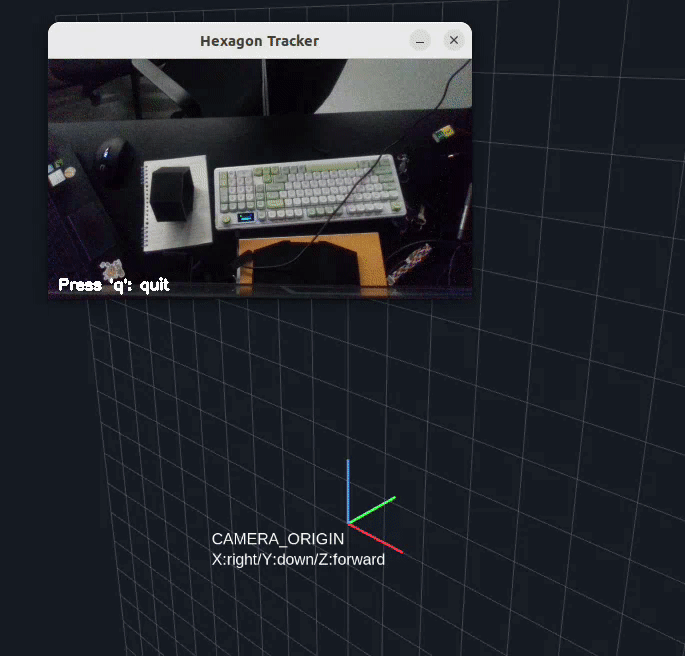
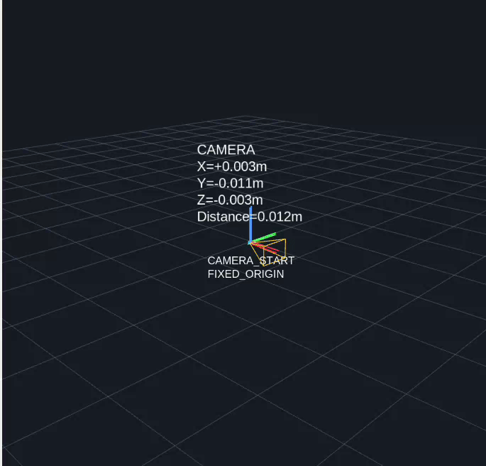
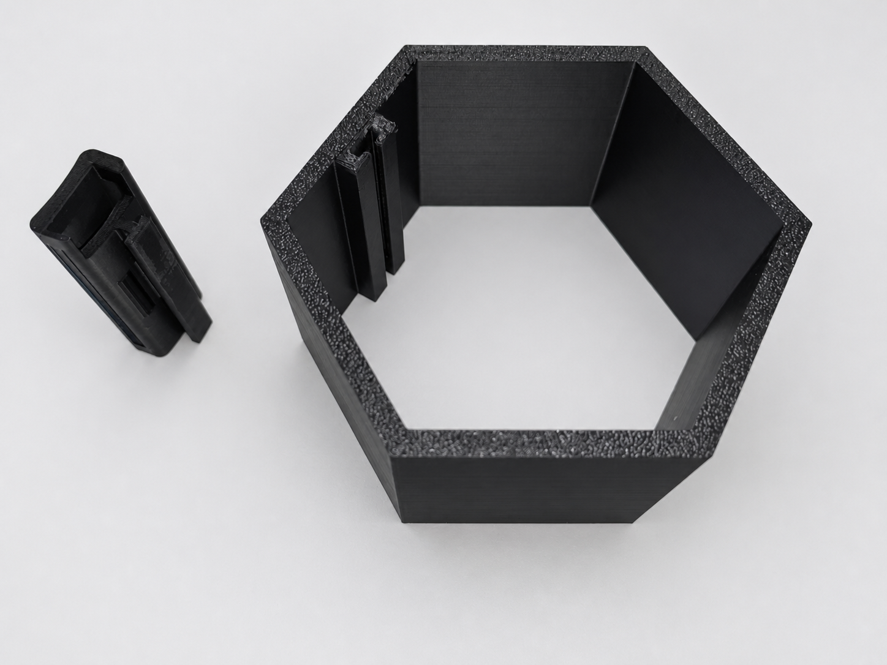
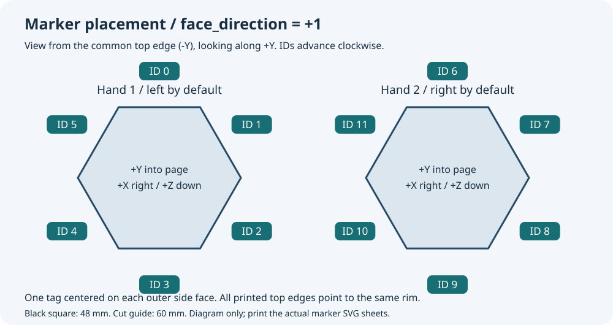

[中文](README.md) | [English](README.en.md)

# 双手示范采集与六棱柱空间跟踪

| 手部六棱柱跟踪 | 相机移动与空间定位 |
|:---:|:---:|
|  |  |

实时演示：左侧识别手上的ArUco六棱柱并显示相机系位姿；右侧显示相机相对初始位置的移动与三维坐标。两段视频独立录制，并非同步画面。结合STM32手套，可记录人手示范，并通过ROS 2向外部机器人适配器提供坐标。

使用 **ArUco 六棱柱、STM32 手套与 ROS 2** 记录人手示范。支持单手/双手视觉跟踪、可选相机空间定位、带时间戳的传感器采集、episode 录制及供外部遥操作适配器读取的坐标。

> 当前定位对象是六棱柱中心，不是手腕或机器人末端。手套输出是原始 ADC，不是关节角。项目不会直接控制机器人。



展示图经过AI美化，最新版图片见[图片目录](doc/pictrue/enhanced/)。接线、尺寸以原始设计资料为准。

## 中英文使用指南

- [数据采集：中文](collection/CAPTURE.md) / [English](collection/CAPTURE.en.md)
- [机器人遥操作接入：中文](collection/TELEOP.md) / [English](collection/TELEOP.en.md)

## 从哪里开始

1. 准备硬件，打印模型与标签 → [打印和贴码](#1-打印与贴码)。
2. 检查相机内参和工作分辨率 → [相机](#2-环境与相机)。
3. 编译烧录手套，先确认串口与读数 → [STM32](#3-stm32编译烧录与采样配置)。
4. 先开视觉，再按需开定位、手套、坐标或录制 → [功能启动表](#4-需要什么功能就启动什么)。
5. 保存并检查示范，最后再导出 → [数据采集](#5-人手示范采集回放与导出)。

所有命令默认在项目根目录执行。`实际episode目录` 等占位符需要替换，输出文件/生成目录使用新名字，避免覆盖原始数据。

## 1. 打印与贴码

### 3D 打印

[3Dprint/](3Dprint/README.md) 保存待打印的 STL：

| 文件 | 用途/注意事项 |
|---|---|
| `hex-hand.stl` | 手部六棱柱主体；外表面贴标签 |
| `handBand.stl` | 腕带安装/连接件，配合主体和绑带使用 |
| `hex-hand-camera.stl` | 带相机安装结构的版本；按实物相机接口检查适配 |
| `hex-robot-arm.stl` | 机械臂侧安装版本；尺寸与手部文件不同，先确认单位和缩放 |

STL 不携带单位。不要把所有文件统一“缩放到相同尺寸”。切片预览、试装并测量实际六棱柱外侧面尺寸后，再设置 `config.yaml` 的几何尺寸。`hex-robot-arm.stl` 包围盒数值约12×10.392×6，不能默认与60mm手部模型同尺寸。打印材料、支撑和填充根据打印机及承载需求决定，本项目未提供强度认证。

### 标签打印

优先打印 [aruco_tags/printable/hand_1_A4.svg](aruco_tags/printable/hand_1_A4.svg) 和 [hand_2_A4.svg](aruco_tags/printable/hand_2_A4.svg)，A4、**100%/实际大小**，关闭适应页面与页眉页脚。

- 字典：`DICT_4X4_250`。第一组六个码：0～5；第二组：6～11，不可重复。
- 当前黑色方形外边长 **48 mm**，不含白边；灰色裁剪框 **60×60 mm**，四周白边各6mm。
- 用尺检查打印尺寸，沿裁剪框剪下，保留白边；不要把标签编码旋转、镜像、拉伸或裁掉黑边。
- 顶层 `aruco_tags/aruco_id_*.png` 是历史单码图片，含12～19等当前未启用ID，不能把它们当当前默认标签组随意贴。

### 贴在哪里、按什么顺序



每个码贴在六棱柱的**一个外侧平面中心**，沿轴向也居中；不贴内侧、顶底开口或跨越棱边。六个码的打印“上边”朝向同一个开口边缘，不能某个码单独转90°/180°。

选一个外侧面作为面0（建议两手都选同一装配参考位置），第一组贴ID0，第二组贴ID6。**从所有码的上边所在开口朝另一端看**，按图示顺时针依次贴0→1→…→5或6→7→…→11。这对应当前 `face_direction: 1` 与几何旋转补偿；若实际反向装配，需要调整标签列表或 `face_direction`，不能仅改显示文字。

贴好后保持物体不动，依次遮挡不同面，让程序分别只看到一个码；中心和朝向应基本一致。若切换可见面时坐标明显跳变，优先检查ID顺序、单码朝向、尺寸和贴合。这里的“默认左/右”来自 `collection/config.yaml` 的映射，实物左右手必须自己核对。

## 2. 环境与相机

基于 Ubuntu 22.04 / ROS 2 Humble，运行节点使用 `/usr/bin/python3`。不要把 Conda 的 OpenCV、NumPy 随意混装进系统 ROS Python。

在已经安装并配置好 ROS 2 Humble 的机器上，安装所需组件：

```bash
sudo apt update
sudo apt install ros-humble-realsense2-camera ros-humble-rtabmap-ros \
  ros-humble-rviz2 ros-humble-cv-bridge ros-humble-message-filters \
  ros-humble-tf2-ros ros-humble-tf2-geometry-msgs \
  python3-opencv python3-numpy python3-scipy python3-yaml python3-serial
source /opt/ros/humble/setup.bash
/usr/bin/python3 -c 'import cv2; print(cv2.__version__); print(hasattr(cv2, "aruco"))'
/usr/bin/python3 -B -m tools.check_config
```

ROS安装本身请使用官方安装说明；上面的apt命令不负责配置ROS软件源。配置检查不保证相机支持所请求的分辨率/帧率。

**RealSense：** `config.yaml` 当前请求彩色424×240、60fps；深度参数在 `rtabmap/config.yaml`。只由跟踪启动脚本启动相机驱动，其余节点订阅同一份数据。内参来自图像对应的 `CameraInfo`，不要打开另一份SDK程序抢占设备。

**普通USB彩色相机：** 先标定，然后在 `config.yaml` 设置 `camera.backend: opencv`、设备、宽高/fps和 `calibration_file`。本项目当前RGB-D RTAB链路不能仅用普通单目相机启动。

```bash
/usr/bin/python3 -B -m tools.generate_calibration_board --output /tmp/charuco_print_v1
/usr/bin/python3 -B -m calibration.camera_calibration \
  --device /dev/video0 --width 640 --height 480 --fps 30 \
  --capture-dir calibration/captures_usb_v1 --output calibration/usb_640x480_v1.yaml
```

标定窗口按 `c` 保存，`q` 完成求解。标定板使用 **DICT_6X6_250**，不是六棱柱字典；实际方格尺寸须与 `calibration/board.yaml` 一致。修改镜头、焦距、裁剪或分辨率后重新确认标定。详见 [calibration/README.md](calibration/README.md)。

## 3. STM32编译、烧录与采样配置

[STM32/](STM32/README.md) 包含固件、PCB和蓝牙脚本。目标为STM32F103C8，工程按8MHz外部晶振、72MHz系统时钟构建，烧录前核对实物。

```bash
sudo apt install --no-install-recommends gcc-arm-none-eabi binutils-arm-none-eabi \
  libnewlib-arm-none-eabi libnewlib-dev make stlink-tools
bash STM32/build_linux.bash -j4
st-info --probe
st-flash --reset write STM32/src/build/linux/22ch/100/glove_22ch_100hz.bin 0x08000000
```

默认 **22通道100Hz、921600波特率**。编译脚本只编译和检查，不自动烧录。看到 `Flash written and verified` 才表示烧录校验通过；`NRST is not connected` 表示缺少复位引脚连接，和USB串口是否存在是不同问题。

ST-Link：SWDIO→PA13、SWCLK→PA14、GND共地；按板卡方案供电，BOOT0保持正常Flash启动状态。USB-TTL数据连接：TX→PA10、RX→PA9、GND共地，信号电平须匹配3.3V；不能并联两个TX驱动STM32 RX。ST-Link不代替数据串口。

常规采集先使用 **22路100Hz**，再按相机时间戳对齐到视频/数据集频率。当前没有30/60Hz固件档位；同频也不等于同步。详见[采样频率说明](STM32/README.md#正式采集如何选频率)。

### 自己切换帧率

同一套源码，通过编译配置选择，**重新编译后还要重新烧录**：

| 通道/频率 | 编译参数（加在脚本后） | 数据波特率 | 状态 |
|---|---|---:|---|
| 22路20Hz | `PROFILE=20` | 921600 | 慢速对照，非绝对真值 |
| 22路100Hz | `PROFILE=100` | 921600 | 默认；吞吐实测通过，模拟精度待验证 |
| 22路200/400Hz | `PROFILE=200` / `PROFILE=400` | 921600 | 实验，仅编译验证 |
| 22路500Hz | `PROFILE=500` | 921600 | 实测无采样缺口，仍有接收错误/精度风险 |
| 22路500Hz快速ADC | `PROFILE=500 ADC_MODE=fast` | 921600 | 缩短ADC采样窗，独立实验 |
| 22路1000Hz | `PROFILE=1000 ADC_MODE=fast` | 1500000 | 实验档位；使用限制见STM32说明 |
| 6路100Hz | `CHANNELS=6 PROFILE=100` | 115200 | 旧六通道基线 |
| 6路1000Hz | `CHANNELS=6 PROFILE=1000` | 921600 | 六路高速实验，不代表22路性能 |

例如200Hz：`bash STM32/build_linux.bash PROFILE=200 -j4`，烧录文件为 `STM32/src/build/linux/22ch/200/glove_22ch_200hz.bin`。快速ADC产物在对应频率下的 `adc_fast/`，文件名带 `_adc_fast`；六路产物仍在 `build/linux/100/` 或 `1000/`。

参数位于 `STM32/src/USER/glove_config.h`，Linux默认值在 `STM32/src/Makefile`。目前PROFILE会同时选择节拍和复用器等待时间，不是单独的发送频率。硬件定时器负责采样节拍，忙等负责切换后的稳定时间；不要简单删除全部等待。采集前需验证传输和传感器读数，参见[STM32说明](STM32/README.md)。

### 验证串口、蓝牙与电路

```bash
/usr/bin/python3 -m serial.tools.list_ports -v
/usr/bin/python3 -B -m glove.record --port /dev/ttyUSB0 --hand left --baud 921600 \
  --duration 60 --output /tmp/glove_left_check_v1.jsonl
/usr/bin/python3 -B -m glove.report /tmp/glove_left_check_v1.jsonl
```

先有线验证，再测试HC-05。AT配置速率与数据速率不同：

```bash
/usr/bin/python3 -B STM32/bluetooth.py --list
/usr/bin/python3 -B STM32/bluetooth.py --master /dev/ttyUSB0 --slave /dev/ttyUSB1 --data-baud 921600
```

两个模块需要分别进入AT模式并经USB-TTL连接；USB编号不代表主从角色。模块是否接受速率、无线是否稳定需实测，不能把有线结果当蓝牙结果。不使用旧 `STM32/serialport_data_get.py` 接收新固件：它是历史文本协议的机器人控制代码。

电路为三颗CD4051复用器：U10的6路→PA0；U6的8路→PB0；U7的8路→PB1。U6/U7共用PA5/6/7地址，U10使用PA1/2/3。PCB公共端电容和传感器源阻抗决定切换稳定时间。原理图、PCB预览、BOM、Gerber和设计源文件见 [STM32/PCB](STM32/PCB/README.md)，接线以原始原理图为准，不能按美化照片识别引脚。

## 4. 需要什么功能就启动什么

| 功能 | 命令 | 前置条件 |
|---|---|---|
| RGB识别、双手位姿/TF、手部RViz | `bash start_tracking.bash` | 相机和正确标签 |
| 相机空间定位、运动轨迹RViz | `bash start_rtabmap.bash` | 上一终端已启动RealSense，RGB-D可用 |
| 相机系手部坐标接口 | `bash start_coordinates.bash --ros-args -p movement_enabled:=false` | 跟踪运行 |
| 包含相机运动的坐标接口 | `bash start_coordinates.bash --ros-args -p movement_enabled:=true` | 跟踪、RTAB和相应TF都有效 |
| 人手示范录制服务 | `bash start_collection.bash --ros-args -p task:='拿起杯子'` | 数据源按需要启动 |

脚本自动加载ROS环境。使用 `ros2` 命令或 `glove.record --ros` 的其他终端需要先 `source /opt/ros/humble/setup.bash`。

```bash
# Optional headless tracking
bash start_tracking.bash show_3d:=false show_window:=false tcp_enabled:=false
# Optional separate map; parent directory must exist
bash start_rtabmap.bash database_path:=/tmp/demo_map.db
```

关闭RViz不等于停止后台节点。相机终端退出后，下游不会再获得新图像；各终端用Ctrl+C退出。

## 5. 人手示范采集、回放与导出

推荐顺序：**跟踪 → 可选RTAB → 左右手套ROS发布 → 录制节点 → 开始一段 → 完成动作 → 保存/检查**。

```bash
# Left glove; run the right glove in another terminal with a different port/file
source /opt/ros/humble/setup.bash
/usr/bin/python3 -B -m glove.record --port /dev/ttyUSB0 --hand left --baud 921600 \
  --ros --output /tmp/glove_left_session_v1.jsonl
```

右手使用另一端口、`--hand right`、另一个输出文件。单手可以不启动另一只手。等待同步有效后录制：

```bash
ros2 service call /human_recorder/start std_srvs/srv/Trigger '{}'
ros2 service call /human_recorder/stop std_srvs/srv/Trigger '{}'
# Discard the current or most recently stopped episode; raw files remain
ros2 service call /human_recorder/discard std_srvs/srv/Trigger '{}'
```

默认保存到 `recordings/日期_随机ID/`：原始PNG、events.jsonl、metadata.json。保存图像原始时间、各通道板端/映射时间、左右手位姿、相机里程计、TF和配置。队列溢出/写盘错误会记录，异常退出的段不当作正常段导出。

```bash
/usr/bin/python3 -B -m collection.review recordings/实际episode目录
/usr/bin/python3 -B -m collection.review recordings/实际episode目录 --play
bash collection/setup_export.bash
.venv-lerobot/bin/python -B -m collection.export recordings/实际episode目录 \
  --output datasets/human_demo_v1 --repo-id local/human-demo
```

安装脚本使用独立环境，可能下载较大的PyTorch依赖；系统需python3-venv和可用视频编码依赖。当前LeRobot导出适配器经过模拟测试，真实MP4/Parquet端到端导出尚未验证。原始录制和回放不依赖LeRobot。

导出是**人手观测数据**，不含机器人action，不是可直接部署的ACT训练集。默认30Hz，缺失图像分段、不压缩时间缺口；缺失手/传感器带有效性掩码。位姿仍为相机系六棱柱位姿，里程计保留原frame含义。详见 [collection/README.md](collection/README.md)。

完整的机器人适配器接入、坐标映射和安全检查见[遥操作接入指南](collection/TELEOP.md)。

## 6. 遥操作坐标接口与时间轴

`/teleop/left/pose`、`/teleop/right/pose`、`/teleop/camera/pose` 使用 `geometry_msgs/PoseStamped`；位置单位米，姿态为xyzw四元数。移动模式默认坐标系为 `odom`，非移动模式为 `camera_color_optical_frame`。通过对应输入时间戳查TF，过期或无TF时停止发布该路新坐标。

```bash
ros2 topic echo /teleop/status
ros2 topic echo /teleop/left/pose
ros2 param set /human_coordinates movement_enabled true
```

`/teleop/movement_enabled` 是坐标模式，不是机器人使能。外部控制器必须自行实现基座/末端标定、工作空间映射、限位限速、超时停止、独立急停和显式使能。默认左/右对应关系必须核对，不能把相机坐标直接发给机器人基座。

视频/视觉位姿使用图像时间戳；手套使用持续微秒时钟，经双向同步映射到电脑时间；里程计保留输入传感器时刻。每通道独立插值，RTT/拟合残差不等于绝对同步误差。相机运动与人手组合还需要同一时刻的正确TF，不能用最新TF代替过去时刻。

## 7. tools与目录地图

```bash
/usr/bin/python3 -B -m tools.check_config
/usr/bin/python3 -B -m tools.generate_aruco_tags --output /tmp/prism_tags_v1
/usr/bin/python3 -B -m tools.generate_calibration_board --output /tmp/calibration_board_v1
```

生成目录必须不存在；改变物理标签尺寸须同步修改配置并重新打印/测量。`tools/print_svg.py` 是生成器共用的SVG辅助模块，不是独立打印命令。

| 目录 | 内容和入口 |
|---|---|
| [3Dprint](3Dprint/README.md) | STL、切片/装配和尺寸核对 |
| [aruco_tags](aruco_tags/README.md) | 标签图片、A4打印页、贴码规则 |
| [STM32](STM32/README.md) | 固件源码、构建、烧录、PCB与蓝牙 |
| [tracking](tracking/README.md) | 六棱柱识别、几何、One Euro、ROS位姿和显示 |
| [rtabmap](rtabmap/README.md) | 共用相机启动、定位、TF与轨迹显示 |
| [glove](glove/README.md) | 二进制解析、时钟同步、记录、统计和对齐 |
| [collection](collection/README.md) | 人手episode录制、回放、导出和坐标接口 |
| [calibration](calibration/README.md) | 普通相机内参标定、ChArUco打印资料 |
| [tools](tools/README.md) | 离线配置检查和打印文件生成 |
| [doc](doc/) | 最新版展示照片和装配示意图 |

`.git`、`.agents`、`.codex` 是版本管理/开发工具元数据，不参与设备使用；`__pycache__` 是运行缓存；`STM32/src/build` 是可重新生成的固件产物。`recordings`、`datasets`、`.venv-lerobot` 是运行或安装后生成的本地目录，不随仓库提交。

## 8. 常见问题与验收边界

- **没有/dev/ttyUSB0：** 先检查实际端口。CH340被USB识别但立即断开时，检查ch341/BRLTTY日志；仅在不使用盲文设备时考虑临时停用冲突服务，不要盲目卸载辅助功能。
- **串口乱码/无有效帧：** 核对已烧录配置的数据波特率、TX/RX交叉与共地、二进制协议版本；AT速率不是数据速率。
- **相机无法打开：** 关闭占用程序，确认设备支持该RGB/深度组合；不要让多个节点各自打开相机。
- **不同标签得到不同中心：** 核对物理黑边尺寸、贴码顺序、旋转方向和相机标定。
- **坐标节点没有输出：** 查看`/teleop/status`，检查数据年龄、frame、TF和移动模式所需的RTAB。
- **导出有缺失掩码：** 检查手是否可见、手套是否发布ROS、同步预热、采样间隔和对齐窗口；不要用旧值冒充当前值。

首次使用按“单相机→单手标签→单手串口→双手→可选移动→录制”的顺序验收。只有硬件稳定、标定一致、时间有效、无明显读数偏差的记录才适合后续训练。
